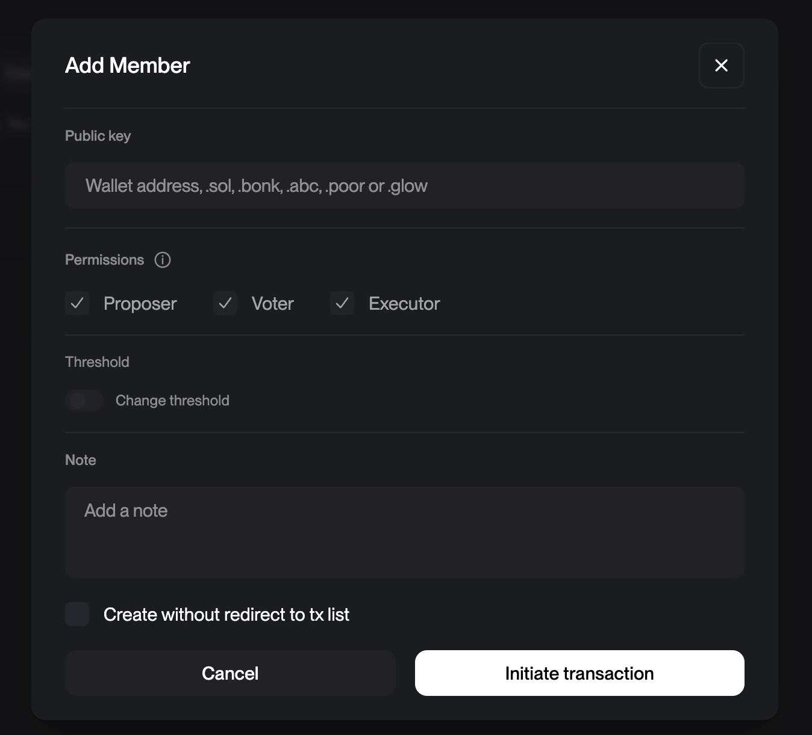

## GitHub Actions Usage

This repository provides GitHub Actions for managing Solana program deployments and verification. The build action figures out the solana and anchor version and builds the program. If it is an anchor program it can also upload the IDL automatically. And it can also verify the program source code on chain.

### How to use

Copy the .github folder and the scripts folder and the tsconfig.json (These are containing the squads SDK integration) into the root of your repository. After you commit these you will be able to use the actions from the github ui.
The build at test flow will run the tests automatically every time the program changes.
Then you can use the build action with all the options you need.

### Required Secrets for specific actions

Some of the options of the build workflow require you to add secrets to your repository:

```bash
# Network RPC URLs
DEVNET_SOLANA_DEPLOY_URL=   # Your devnet RPC URL - Recommended to use a payed RPC url
MAINNET_SOLANA_DEPLOY_URL=  # Your mainnet RPC URL - Recommended to use a payed RPC url

# Deployment Keys
DEVNET_DEPLOYER_KEYPAIR=    # Base58 encoded keypair for devnet
MAINNET_DEPLOYER_KEYPAIR=   # Base58 encoded keypair for mainnet

PROGRAM_ADDRESS_KEYPAIR=    # Keypair of the program address - Needed for initial deploy and for native programs to find the program address

# For Squads integration
DEVNET_MULTISIG=           # Devnet Squads multisig address
DEVNET_MULTISIG_VAULT=     # Devnet Squads vault address
MAINNET_MULTISIG=          # Mainnet Squads multisig address
MAINNET_MULTISIG_VAULT=    # Mainnet Squads vault address
```

### Extends and automate

You can easily extend or change your workflow. For example run the build workflow automatically on every push to a development branch.

```bash
  push:
    branches:
      - develop
      - dev
      - development
    paths:
      - 'programs/**'
      - 'Anchor.toml'
      - 'Cargo.toml'
      - 'Cargo.lock'
```

Or run a new release to mainnet on every tag push for example.

```bash
  push:
    tags:
      - 'v*'
```

Customize the workflow to your needs!

### Running the actions locally

If you for some reason want to run the actions locally you can do so with the following commands using the act command.

Follow the instructions [here](https://nektosact.com/installation/index.html) to install act.

1. Build

Just pick the parameters you want. This is using act to run the workflow locally. Good for testing or if you dont want to install anything because this is running in docker and outputs the build artifacts as well.

```bash
act -W .github/workflows/build.yaml \
 --container-architecture linux/amd64 \
 --secret-file .secrets \
 workflow_dispatch \
 --input program=transaction-example \
 --input network=devnet \
 --input deploy=true \
 --input upload_idl=true \
 --input verify=true \
 --input use-squads=true
```

2. Run anchor tests

Note: The anchor tests use solana-test-validator which does not work in act docker container on mac because of AVX dependency. Wither run them in github, locally without docker or open PR to fix it. I couldnt find a nice way to fix it.
You can adjust the workflow to run your specific tests as well.

```bash
act -W .github/workflows/test.yaml \
 --container-architecture linux/amd64 \
 --secret-file .secrets \
 workflow_dispatch \
 --input program=transaction-example
```

### Features

- ✅ Automated program builds
- ✅ Program verification against source code
- ✅ IDL buffer creation and uploads
- ✅ Squads multisig integration
- ✅ Support for both devnet and mainnet
- ✅ Compute budget optimization
- ✅ Retry mechanisms for RPC failures

## How to setup Squads integration:

In general its recommended to use the [Squads Multisig](https://docs.squads.so/squads-cli/overview) to manage your programs.
It makes your program deployments more secure and is considered good practice.

1. Setup a new squad in [Squads](https://v4.squads.so/squads/) then transfer your program authority to the squad.

2. Add your local keypair to the squad as a member (At least needs to be a voter) so that you can propose transactions. And also add that keypair as a github secret.
   To run it locally add the following to your .secrets file:



```bash
DEVNET_DEPLOYER_KEYPAIR=
MAINNET_DEPLOYER_KEYPAIR=
```

2. Add the following to your .secrets file if you want to run it locally or add them to your github secrets if you want to run it in github actions:

```bash
DEVNET_MULTISIG=
DEVNET_MULTISIG_VAULT=
MAINNET_MULTISIG=
MAINNET_MULTISIG_VAULT=
```

Where Multisig vault is the address you can find on the top left corner in the [Squads Dachboard](https://v4.squads.so/squads/)
The MULTISIG is the address of the multisig you want to use this one you can find the the settings. Its a bit more hidden so that people dont accidentally use it as program upgrade authority.

What this will do is write a program and an IDL buffer for your program and then propose a transaction that you can approve in the Squads UI.

4. Now you can run the workflow with the following command:

```bash
act -W .github/workflows/build.yaml \
 --container-architecture linux/amd64 \
 --secret-file .secrets \
 workflow_dispatch \
 --input program=transaction-example \
 --input network=devnet \
 --input deploy=true \
 --input upload_idl=true --input use-squads=true --input verify=true
```

## 📝 Todo List

### Program Verification

- [x] Trigger verified build PDA upload
- [x] Verify build remote trigger
- [x] Support and test squads Verify
- [x] Support and test squads IDL
- [x] Support and test squads Program deploy

### Action Improvements

- [x] Separate IDL and Program buffer action
- [ ] Remove deprecated cache functions
- [x] Remove node-version from anchor build
- [ ] Support matrix build for develop branch
- [ ] Skip anchor build when native program build
- [ ] Make verify build and anchor build in parallel
- [x] Trigger release build on tag push
- [x] Trigger devnet releases on develop branch?
- [x] Make solana verify also work locally using cat
- [x] Use keypairs to find deployer address to remove 2 secrets
- [x] Add priority fees
- [x] Add extend program if needed
- [ ] Bundle the needed TS scripts with the .github actions for easier copy paste

### Testing & Integration

- [x] Add running tests
  - Research support for different test frameworks
- [ ] Add Codama support
- [ ] Add to solana helpers -> release

Close Buffer:

You may need this in case your deploy failed and you want to close a buffer that was already transfered to your multisig.

```bash
solana program show --buffers --buffer-authority <You multisig vault address>

npx ts-node scripts/squad-closebuffer.ts \
 --rpc "https://api.mainnet-beta.solana.com" \
 --multisig "FJviNjW3L2u2kR4TPxzUNpfe2ZjrULCRhQwWEu3LGzny" \
 --buffer "7SGJSG8aoZj39NeAkZvbUvsPDMRcUUrhRhPzgzKv7743" \
 --keypair ~/.config/solana/id.json \
 --program "BhV84MZrRnEvtWLdWMRJGJr1GbusxfVMHAwc3pq92g4z"
```

### Notes

- When using Squads, the workflow will create a proposal that needs to be approved in the Squads UI
- For first deployments, program IDL authority errors can be ignored
- If you run into any problems please open an issue and/or help fix it please :)

#### additional notes

- IDL must be upgraded before program upgrade instruction other wise it will fail
- Buffer authority and program upgrade cannot be in the same transaction for some reason (at least using squads) thats why its set during the workflow and not in the squads scripts
